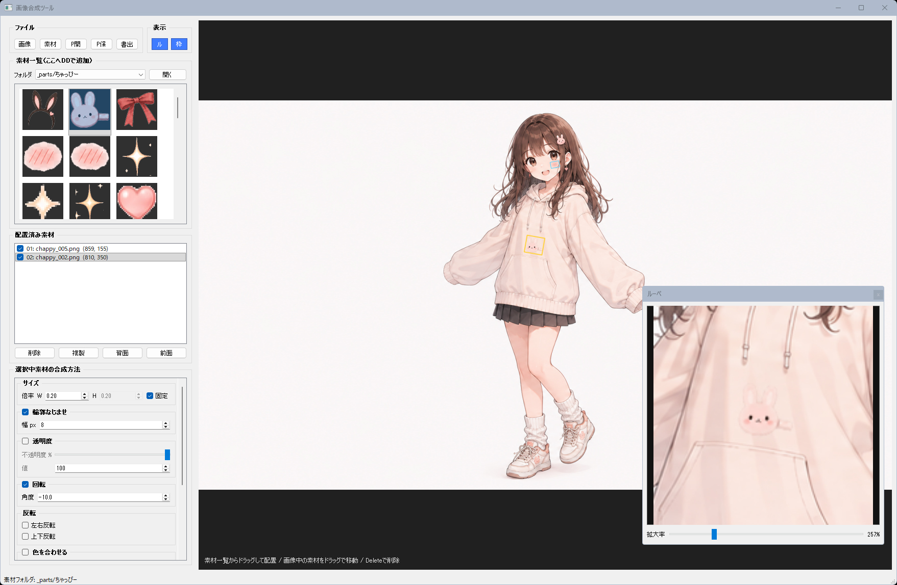

# 画像合成ツール



## 機能概要

元画像の上に素材画像を配置して、輪郭なじませ・透明度・色合わせ・影などを調整しながら自然に合成するためのGUIツールです。
AI生成画像のちょっとした手直しや、パーツ合成、ゲーム素材の仮合わせなどに使いやすいように作っています。

### 主な機能

* Python製のGUIツール
* 日本語パス対応
* 画像ファイルのドラッグ＆ドロップ読み込み対応
* 元画像の上に複数の素材を配置可能
* 素材は `_parts/default` などの素材フォルダで管理
* 素材フォルダを切り替えて素材一覧を表示
* 素材の表示／非表示切り替え
* 配置済み素材の複製、前面／背面移動、削除
* 素材の拡大縮小

  * W / H 個別倍率対応
  * 縦横比固定ON/OFF対応
* 素材の回転
* 左右反転・上下反転
* 輪郭なじませ

  * 素材の輪郭から内側へグラデーション透過
* 透明度調整
* 色合わせ

  * 元画像全体に合わせる
  * 配置場所に合わせる
  * 標準、白黒除外、K-Means、ヒストグラムマッチング、明るさのみ調整に対応
* 影の追加
* ルーペ表示

  * 別ウィンドウ表示
  * ホイールで拡大率変更
* 枠表示ON/OFF

  * 全素材の枠表示
  * 選択中素材だけ別色表示
* プロジェクト保存／読み込み
* ウィンドウ位置・サイズ、分割位置などの設定自動保存
* PNG / JPEG / WEBP 書き出し対応

### 一言で言うと

「画像に素材を置いて、いい感じになじませるツール」

## 使い方

1. **アプリを起動する**

   ターミナルで以下を実行します。

   ```bash
   python image-compositor.py
   ```

   必要ライブラリは先にインストールしておいてください。

   ```bash
   pip install PyQt5 opencv-python numpy
   ```

2. **ファイルを読み込む**

   元画像は、左上の **[画像]** ボタン、または右側のプレビュー領域へのドラッグ＆ドロップで読み込めます。

   対応形式の例：

   * PNG
   * JPG / JPEG
   * WEBP
   * BMP
   * TIFF

   素材画像は、**[素材]** ボタン、または素材一覧へのドラッグ＆ドロップで追加できます。
   追加した素材は、選択中の素材フォルダにコピーされます。

   デフォルトでは以下に保存されます。

   ```text
   _parts/default
   ```

   `_parts` の中に自分でフォルダを作ると、素材フォルダのコンボボックスから切り替えられます。

3. **素材を配置する**

   左側の素材一覧から素材をドラッグして、右側の元画像プレビュー上にドロップします。

   配置した素材は、画像上でドラッグして移動できます。
   配置済み素材リストから、表示／非表示、削除、複製、前面／背面移動もできます。

4. **設定を行う**

   選択中の素材に対して、以下のような合成設定を調整できます。

   * サイズ

     * W / H倍率
     * 縦横比固定ON/OFF
   * 輪郭なじませ

     * 輪郭から内側へ指定px分をグラデーション透過
   * 透明度

     * 不透明度を%で調整
   * 回転

     * 任意角度で回転
   * 反転

     * 左右反転
     * 上下反転
   * 色を合わせる

     * 元画像全体、または配置場所を参照
     * 複数の色合わせモードを選択可能
   * 影

     * 濃さ、ぼかし、X/Y位置を調整

5. **プレビューを確認**

   右側に合成結果がプレビュー表示されます。

   ルーペを使うと、右クリックで指定した位置を拡大表示できます。
   ルーペ上でマウスホイールを回すと、拡大率を変更できます。

   **[枠]** ボタンをONにすると、配置済み素材の枠を常時表示できます。
   選択中の素材は別色で表示されます。

6. **プロジェクトを保存／開く**

   作業途中の状態は **[P保]** で保存できます。
   保存される内容は、元画像パスと配置済み素材の位置・設定です。

   保存したプロジェクトは **[P開]** で読み込めます。

   起動時には元画像や配置済み素材は自動復元しません。
   必要な作業データはプロジェクトとして開いてください。

7. **書き出しを実行する**

   **[書出]** ボタンから合成結果を書き出します。

   対応形式：

   * PNG
   * JPEG
   * WEBP

   透過を保持したい場合はPNGがおすすめです。

## おすすめ設定例

### 軽くなじませたい場合

* 輪郭なじませ：4〜8px
* 透明度：85〜95%
* 色合わせ：白黒除外、強度40〜60%
* 影：薄め、ぼかし多め

### 背景にしっかりなじませたい場合

* 輪郭なじませ：8〜16px
* 色合わせ：配置場所
* 色合わせモード：ヒストグラムマッチング、または白黒除外
* 色合わせ強度：50〜80%
* 影：必要に応じて追加

### 色だけ少し合わせたい場合

* 色合わせ：ON
* モード：明るさだけ合わせる
* 強度：30〜50%

色合わせを強くしすぎると素材の色が崩れることがあるので、まずは弱めから調整するのがおすすめです。

## 必要環境

* Python 3.10以上
* PyQt5
* OpenCV
* NumPy

インストール例：

```bash
pip install PyQt5 opencv-python numpy
```

## ライセンス

**MIT License** で公開しています。
ご自由に使って、改変して、参考にしてください。
ただし**自作発言はNG**でお願いします。
